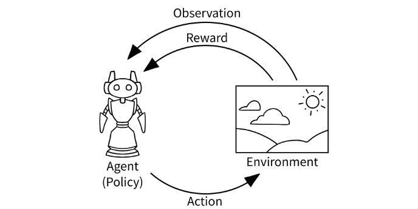

# 1.安装依赖
安装miniconda 
~~~bash
conda create -n RL_mario python==3.8.8
~~~

降低setuptools,wheel,pip的版本
~~~bash
pip install setuptools==65.5.0
pip install wheel==0.38.4
python.exe -m pip install pip==20.2.4
~~~

然后安装依赖
~~~bash
cd /path/to/your/workspace/
pip install -r requirements.txt
~~~

安装torch(会自动卸载已有的)
~~~bash
谷歌搜索 torch 镜像 轮子 找到对应下载
这里选择cu118+cy38+win+torch2.0.0
pip install "文件名"
~~~

验证torch
~~~bash
python 
import torch
print(torch.__version__)  # 应该输出 2.0.0
print(torch.cuda.is_available())  # 如果是 True 说明 CUDA 可用
print(torch.version.cuda)  # 应该输出 11.8
~~~

